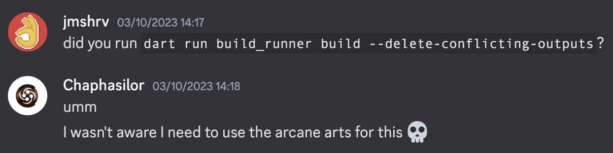

# Contributing to Finamp

Thanks for your interest in contributing to Finamp! This document goes over how to get started on Finamp development, and other ways to contribute.

## Setting up a Development Environment

Finamp is a fairly standard Flutter app, so all you have to do is [install Flutter](https://docs.flutter.dev/get-started/install). Once Flutter is installed, you should be able to run Finamp on emulators/real devices.  
After installing Flutter you can check if every need component is installed by running:

```bash
flutter doctor -v
```

This will list out all components used for Flutter development, and if they are installed. This should include either Android or iOS development (depending on your platform), as well as any desktop platform you want to target.  
You can ignore the Chrome/Web component, since Finamp is not a web app.

### Building for Android

You can build debug builds for Android right-away, but you will get an error if you try to build a release build (which is the default type).  
To build release APKs, you need to set up a signing key for Android. To get that set up, follow [this guide](https://docs.flutter.dev/deployment/android#signing-the-app) from the Flutter documentation.
Respectively, you can also set a custom keystore for debug builds by setting the `debugKeystoreFile`, `debugKeystorePassword`, `debugKeyAlias`, and `debugKeyPassword` variables in the same `android/key.properties` file.
This should not be necessary for most users, but can be useful if you develop on multiple machines and easily want to share the same debug key.
Note that Finamp is configured to use a different app ID for debug builds by default, so if you install a release build and a debug build, you will have two independent versions of Finamp installed on your device.
This also means that you can keep using your regular install of Finamp (from the Play Store, etc.) while developing new features for Finamp, without breaking your ability to listen to music :)  

If you try to install a release build you built yourself (with your signing key) on top of a release build you downloaded from the Play Store or GitHub, Android will prevent you from doing so and show a generic error message. The only solution here is to uninstall the existing version, and then install your build. Note that this will delete any logins, settings and downloads that you had configured.  
This generally shouldn't be needed, since debug builds works fine for daily usage, even though they are a bit less performant.

### Developing on an Android Device without Android Studio (on linux)
1. You need the following packages  
    *you may need to find out the equivalents for your distro, these are for Arch*  
    `android-sdk android-sdk-build-tools android-sdk-cmdline-tools-latest android-platform android-sdk-platform-tools`
2. Ensure your active java version is jdk17, newer/older might still work but 17 definitely does
3. Accept license  
    `flutter doctor --android-licenses && sudo /opt/android-sdk/cmdline-tools/latest/bin/sdkmanager --licenses`
4. Enable USB debugging on your phone
5. Connect your phone via usb to your pc
6. Find your device  
    `flutter devices`
7. Run on device  
    `flutter run -d <device>` eg. for google pixel phones `flutter run -d pixel`   
8. Go back to develop on linux   
    `flutter run -d linux`

### Code Generation (The Arcane Arts)



Because Dart doesn't support macros, a few dependencies rely on code generation which must be run manually.  
You'll have to do this whenever you:

- Create a new setting (in `lib/models/finamp_models.dart`)
- Create a new class/type or extend and existing one, where you **use type annotations** (e.g. `@HiveType`, `@HiveField`, `@Isar`, `@riverpod`, `@JsonSerializable`, ...)
- Modify the Jellyfin API interface (`lib/services/jellyfin_api.dart`)

To perform the code generation, run:

```bash
dart run build_runner build --delete-conflicting-outputs
```

If you can't launch Finamp (e.g. with `flutter run`) after generating code you may need to run `flutter clean` and then try both commands again. This must be done when:

- Modifying a class that is returned by Jellyfin (such as the classes in `lib/models/jellyfin_models.dart`)
- Adding fields (annotated with `@HiveField`) to a database class (annotated with `@HiveType`)

>[!WARNING]
> **If you don't rebuild generated files**, you will encounter some issues:
>
> - Settings not persisting
> - Hive/Isar errors on startup
> - Missing data when converting JSON to classes

Aside from generating the code you'll also have to explicitly use the generated code in some cases:

- After creating a **new** class annotated with `@HiveType` in `lib/models/finamp_models.dart` (or another file), you need to first run code generation and then register the newly generated Hive adapter.  
  This is done in `main.dart`, in the `setupHive()` method. Simply add another line like `Hive.registerAdapter(YourNewClassNameAdapter());`, where `YourNewClassName` is the name of the class, and you append the word `Adapter` at the end.

In detail, the actual dependencies and purposes for the code generation are:

- Hive - the database that Finamp uses for storing most data
- Isar - Hive's younger/newer brother, which powers Finamp's login & download system
- `json_serializable` - For serializing and deserializing JSON from/into classes, e.g. automatically converting data between Finamp's internal representation and the Jellyfin API
- Chopper - For talking to Jellyfin over HTTP
  - This layer (`lib/services/jellyfin_api.dart`) is not used by the app directly. The user-facing API is located at `lib/services/jellyfin_api_helper.dart`.
- Riverpod - For reactive state management throughout the app
- Most recently, Finamp's settings helpers - These are methods automatically generated for getting and settings any settings within Finamp.

### Hive

As mentioned above, Finamp uses Hive for most data storage needs. If you're doing work that involves data storage, we recommend you read [the Hive docs](https://docs.hivedb.dev/#/). Please ensure that your changes work when upgrading Finamp from the current release to your changes, as not handling upgrades will cause the app to crash.  

>[!IMPORTANT]
> When downgrading or switching between branches, you will have to wipe your app data if any changes were made to Hive, otherwise you'll encounter Hive-related errors.

When creating new types, note that you'll also have to register an adapter in `main.dart`. After code generation, there should be a class called `[YourType]Adapter`, which you can initialize in `setupHive`.

## Project Structure

TODO

## The Redesign

The biggest main piece of work being done on Finamp at the moment is the redesign. The relevant meta-issue can be found [here](https://github.com/jmshrv/finamp/issues/220).  
The `redesign` branch has diverged a lot from the stable version on `main`, and `main` is in a "maintenance mode" at this point, with only occasional bug fixes.  
**Please use the `redesign` branch as your source branch when working on new features and creating pull requests!**  
We won't accept new features for the `main` branch at this point.

## Designing

As the name implies, we'll need many fresh design mockups for the redesign. Some are already done, some are still being interated on, and some mockups haven't been started yet.

If you are a designer or have ideas on how the new user interface could/should look, then it would be amazing and really helpfull if you would create a mockup!  
You can share your mockups in an issue here on GitHub (use a relevant one if possible, otherwise create a new one) or on Discord for further discussion.  
Once the mockup is finalized, people can start implementing it.

There's also a Figma file with some existing mockups that you can go off of: <https://www.figma.com/design/wVizekpm9YchvHFP6l508r/Finamp?node-id=101-425&t=27CRT9QAwFhlIMqm-1>  
Some of the designs in there are already outdated or still a work in progress. When in doubt, you should look at the current design in the actual app, or ask us about it!

## Translating

Finamp uses Weblate to manage translations: **<https://hosted.weblate.org/engage/finamp/>**

Feel free to add new languages if yours isn't there yet.  
If you have any questions, such as the context of a string, you can ask in the [Translation Discussions](https://github.com/jmshrv/finamp/discussions/categories/translations). There's also a channel on our [Discord server](https://discord.gg/xh9SZ73jWk) for potentially getting a reply faster.

## Packaging

### Linux

Linux packaging might vary depending on distribution and type of installation.
Please follow the guidelines of your distribution if you would like to package Finamp for it.
The repo contains a [desktop file template](assets/finamp.desktop.m4) and
pre-generated icons following the XDG Icon Theme Specification
in the [assets folder](assets/icon/linux).
