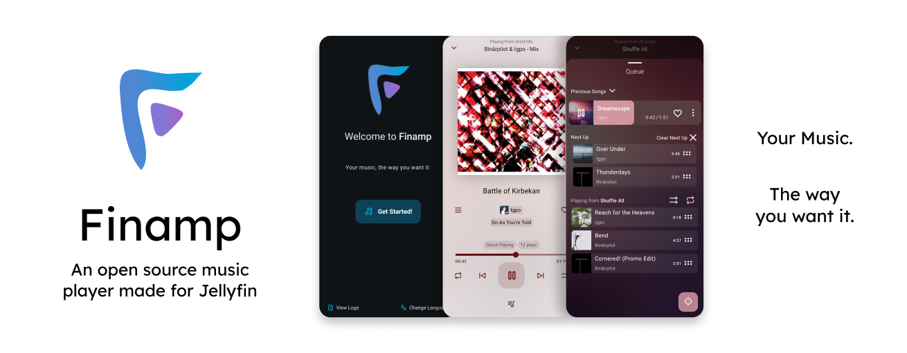
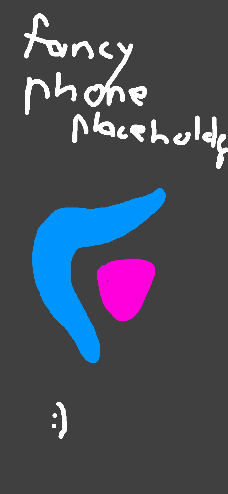

 
 

*[Alternative ways to get finamp](#other-installation-methods)*

## TL;DR
Finamp is a **free** Jellyfin music player for Android, iOS and Desktop. It allows you to Stream and Download the music you own. It has a **modern design** that should feel familiar right-away, a few **customizations** and of course **privacy**!

> [!IMPORTANT]
> You do **need** access to a [Jellyfin](https://jellyfin.org) server else you **won't be able to use Finamp at all**.

## Features
Finamp comes with a bunch of features, we have hand picked a few **features** we believe you'll be the **most interested** in:
- Download music to listen offline
- Transcoded streaming for reduced mobile data usage
- Dynamic colors based on the current song applied to an unique and modern look&feel
- Lyrics Support
- Audio volume normalization
- [Desktop App](#other-installation-methods)
- Support for the [Playback Reporting](https://jellyfin.org/docs/general/server/plugins/#playback-reporting) Plugin, even when you are offline!
- Android Auto

*And more for you to explore!*

## FAQ - Frequently Asked Questions

#### Is Finamp Free?
Yes. Contributions and donations of any kind are of course welcome!

#### What are Supported Formats?
Mostly All. Generally speaking if Jellyfin and your Device support an format, Finamp will too! In case an format doesn't work you can always enable transcoding.

#### Does finamp support Android Auto / Apple Carplay?
No, but yes. Native support is in development but you can still connect your phone to your car and start listening.

#### Is Finamp Legal?
Finamp is Legal. Because Finamp requires a Jellyfin server for streaming Music the Admin is responsible for buying music from Artists.

## Bugs, Problems and Feature Requests 
If you encounter any errors, issues, accessibility problems or the likes please feel free to look the the [issue tracker](https://github.com/jmshrv/finamp/issues) and open a new issue if there isnt one already.

## Contributing
### Code
Just like any [FOSS software](https://en.wikipedia.org/wiki/Free_and_open-source_software) Finamp also relies on your contributions!
If you are interested you can consult the [Contribution Guidelines](https://github.com/jmshrv/finamp/blob/main/CONTRIBUTING.md) to get stated. Anything helps!

### Translations
You can also help out by translating Finamp using our [weblate page](https://hosted.weblate.org/engage/finamp/). Here is the current state of translations:

    

## Screenshots
<h3 align="left">Login</h3>
<table>
  <tr>
    <td valign="top">
      
    </td>
    <td valign="top">
Lorem ipsum dolor sit amet, consectetur adipiscing elit. Aenean et faucibus dolor, sit amet convallis ligula. Maecenas tortor mauris, venenatis id bibendum quis, mollis et purus. Nam nec massa pellentesque, rutrum nulla vel, scelerisque velit. Fusce placerat sollicitudin neque a maximus. Morbi ullamcorper, lacus sit amet sagittis volutpat, risus tortor congue nisi, non mattis urna dolor ac augue. Vivamus viverra, eros id mattis accumsan, nisi libero accumsan erat, quis euismod ipsum massa in sapien. In tristique dolor ut orci laoreet, eget euismod ligula tristique. Vivamus condimentum ornare sodales. Cras vel pulvinar lorem. Vivamus vel tristique enim. Ut vitae dignissim velit.
    </td>
  </tr>
</table>

<h3 align="right">Home</h3>
<table>
  <tr>
    <td valign="top">
Maecenas felis ipsum, viverra sed diam nec, venenatis scelerisque tortor. Integer sit amet tortor suscipit, auctor dui nec, venenatis libero. Maecenas ultrices luctus turpis et porttitor. Donec eu venenatis ante. In hac habitasse platea dictumst. Pellentesque in ultrices neque. Fusce venenatis feugiat ex laoreet ultrices. Curabitur ac erat nisi. Integer porttitor, nibh eu vehicula condimentum, mauris ipsum pulvinar purus, eget convallis lectus sem a nunc. Pellentesque eu malesuada augue, ut placerat lorem. Fusce a nibh non massa vestibulum congue. Nulla leo dui, venenatis ac consequat sit amet, facilisis vel nisl. Duis sagittis neque at ultricies aliquam. 
    </td>
    <td valign="top">
      
    </td>
  </tr>
</table>

<h3 align="left">Player</h3>
<table>
  <tr>
    <td valign="top">
      
    </td>
    <td valign="top">
Fusce justo est, commodo non lacinia eu, semper nec urna. Phasellus eros arcu, condimentum ac venenatis non, aliquam ut turpis. Sed in ligula sit amet justo luctus tincidunt. Morbi vestibulum mi lorem. Aliquam erat volutpat. Vivamus sodales, lacus non tristique efficitur, mi felis lobortis ligula, quis ultrices nisi odio eu eros. Sed vehicula magna vel fermentum tincidunt. Sed ac sodales purus. Pellentesque a tincidunt mi, eu tincidunt nulla. Maecenas quis commodo nibh. Pellentesque non tortor ex. Phasellus pretium rhoncus tempus. Etiam ac elit eu mauris scelerisque semper quis id mi. Vivamus et rutrum sem. Morbi tristique, lorem vitae tincidunt auctor, metus sapien finibus neque, eu gravida est tortor nec quam. Vestibulum eget pellentesque ligula. 
    </td>
  </tr>
</table>

<h3 align="right">Album / Playlist</h3>
<table>
  <tr>
    <td valign="top">
Aenean semper, massa tempor laoreet finibus, sem justo tristique mauris, vitae consequat nisi leo a massa. Aliquam in facilisis lectus. Vivamus urna libero, aliquet sit amet fringilla sit amet, molestie sed elit. Mauris nec ex maximus, sollicitudin tellus nec, placerat sapien. Duis sit amet aliquam turpis, nec consectetur tortor. Suspendisse vestibulum semper eleifend. Proin imperdiet erat at libero luctus, fermentum ullamcorper nibh volutpat. Maecenas sed nunc eleifend, eleifend odio a, malesuada justo. Nam a sagittis eros. Nulla efficitur lorem at dapibus iaculis.
    </td>
    <td valign="top">
      
    </td>
  </tr>
</table>

<h3 align="left">Settings</h3>
<table>
  <tr>
    <td valign="top">
      
    </td>
    <td valign="top">
Praesent non augue sit amet sapien venenatis lobortis. Praesent eu ipsum ac mauris rutrum imperdiet. Ut ut mi lacus. Nunc nulla est, sollicitudin eget ornare a, blandit eu sapien. Vestibulum luctus feugiat congue. Vestibulum aliquam sed diam eu maximus. Quisque molestie sollicitudin blandit. Maecenas sed mauris feugiat, porta tellus nec, lobortis lectus. Pellentesque metus libero, lacinia ac aliquam vel, ullamcorper quis enim. Integer sed leo faucibus, euismod quam sed, aliquet ligula. Vivamus sit amet lectus sem. Mauris tincidunt sollicitudin nulla eget imperdiet. 
    </td>
  </tr>
</table>

<h3 align="right">Downloads</h3>
<table>
  <tr>
    <td valign="top">
Sed facilisis nec lorem vitae blandit. Nullam finibus neque sit amet velit varius vulputate. Nunc dapibus congue leo, sit amet porta ligula vehicula id. Nunc porttitor mi at augue suscipit sagittis. Quisque ac rutrum risus. Donec ut est ultrices, accumsan nisl tincidunt, faucibus mauris. Orci varius natoque penatibus et magnis dis parturient montes, nascetur ridiculus mus. 
    </td>
    <td valign="top">
      
    </td>
  </tr>
</table>

## Other installation methods
#### Android
TODO

#### Windows
TODO

#### Mac
TODO

#### Linux
| Distro | Command         |
|:-------|:----------------|
| Arch   | `yay -S finamp` |

# Shoutout
- Thanks to all the [Contributors and Maintainer](https://github.com/jmshrv/finamp/graphs/contributors) (see bellow) who helped to make, fix and improve Finamp! Without you Finamp wouldn't be Finamp. ❤️
- Thanks to the [Jellyfin Contributors](https://jellyfin.org/contribute/) without whom Finamp wouldn't exists in the first place and thanks for making self-hosting and privacy easier!
- Thanks to all the Developers who created and maintain packages Finamp uses!
- And thank **you** for using Finamp!

# Contributers 

